<div align="center">

# 🏋️ FitMentor AI

**A real-time AI gym coach in your browser — it watches your webcam, counts your reps, checks your form, and speaks corrections back to you while you're still mid-set.**


[Demo](#-demo) · [Architecture](#-overall-architecture) · [Tech Stack](#-technology-stack--complete-breakdown) · [Quick Start](#-installation) · [Deployment](#-deployment-guide) · [Rebuild Guide](#-rebuilding-it-yourself--a-suggested-order)

</div>

---

## 📸 Demo

> 📸 *Add screenshots or a demo GIF here — drop the files into [`docs/images/`](docs/images/) and replace this note.*
> Recommended: **(1)** a GIF of a live squat set with the skeleton overlay and the rep counter rising, **(2)** the sidebar during a workout showing angles and form status, **(3)** the coach feedback banner showing a correction, **(4)** the Workout History table.

**Real output of the pose pipeline** — the exact `VideoProcessorClass.recv()` code path, run on a public-domain test photo during automated testing (Biceps Curl mode, ~16 ms per frame on a laptop CPU):

<p align="center">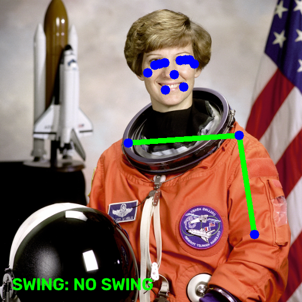</p>

---

## 🧩 Problem Statement

Correct form decides whether an exercise builds strength or quietly damages joints. A squat with collapsing knees, a push-up with sagging hips, or a curl powered by a torso swing moves load away from the target muscle and onto structures that weren't built to carry it. Personal trainers fix this by **watching and correcting during the set** — but trainers are expensive and appointment-bound, so most people training at home, in a budget gym, or in a hostel room never get that feedback. Mainstream fitness apps log sets, reps and calories; they can't see *how* you moved.

## 💡 Solution Overview

FitMentor AI recreates the trainer's watch-and-correct loop in software, using only a webcam and a browser:

1. **See** — the browser streams the webcam to the server over WebRTC; Google MediaPipe's Pose Landmarker extracts 33 body landmarks per frame.
2. **Measure** — a shared vector-geometry function turns landmark triples (e.g. hip–knee–ankle) into joint angles.
3. **Judge** — five rule-based detectors (Squats, Push-ups, Biceps Curls, Shoulder Press, Lunges) count reps with a two-threshold state machine and check exercise-specific form faults.
4. **Speak** — form faults become a short coaching line from Llama 3.3 70B (via Groq), converted to speech with gTTS and auto-played.
5. **Remember** — completed sets are saved per user, per exercise, per day in SQLite.

No dataset or model training is involved: it is **geometry + rules + a prompt-constrained LLM**, which makes every decision explainable line by line.

## ✨ Key Features

| Feature | What it does | Where it lives |
|---|---|---|
| Live pose tracking | 33 landmarks per frame, skeleton + HUD drawn on the video | `services/vision/exercise_video_processor.py` |
| 5 exercise detectors | Rep counting with hysteresis + exercise-specific form checks | `detectors/*.py` |
| Form-fault detection | Depth, back lean, hip sag/pike, elbow drift, torso swing, back arch, balance | `detectors/*.py` |
| Spoken AI coaching | Event-driven LLM cues, 5 s cooldown, never crashes on API failure | `services/coaching/*` |
| Sets/reps tracking | Plan sets × reps; progress derived from the rep count | `services/tracking/metrics.py` |
| Workout history | Same-day aggregation per exercise, shown as a table | `services/persistence/exercise_repository.py` |
| Username sessions | Lightweight identity so history survives across visits | `services/auth/login_wall.py` |
| Cloud-ready WebRTC | Automatic TURN relay when `HF_TOKEN` is set | `main.py` (no hard-coded ICE config) |
| Self-healing model download | Atomic download of the pose model on first use | `services/vision/model_loader.py` |
| Test suite | 65 pytest tests incl. real-model inference and full UI flow | `tests/` |

---

## 🏛️ Overall Architecture

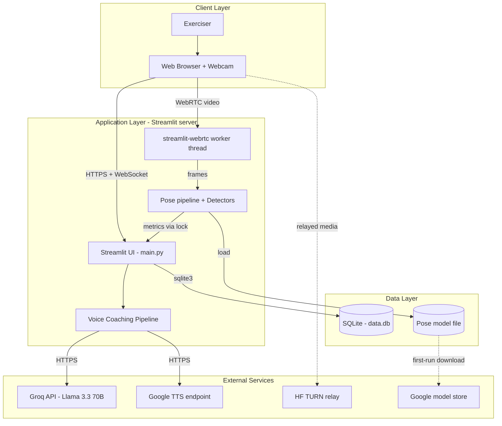

## 🧱 System Architecture

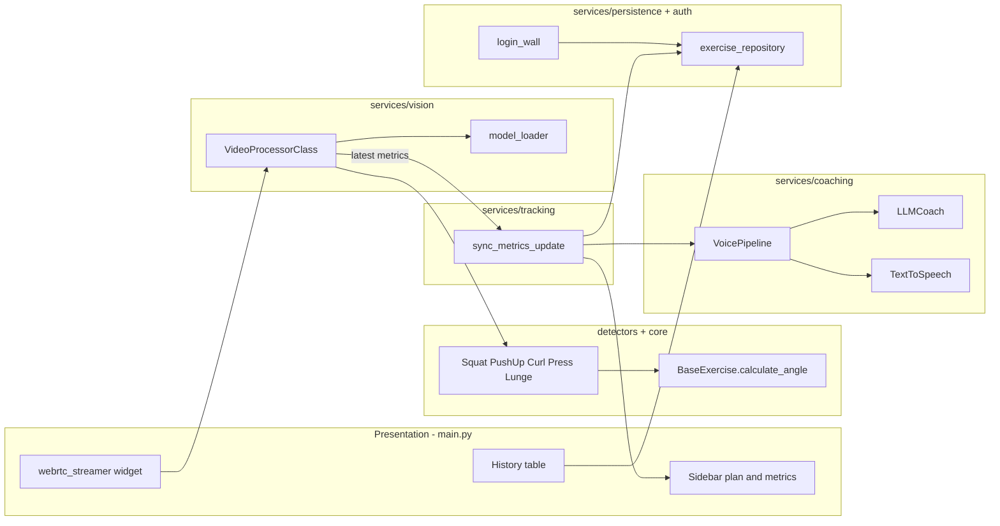

**Why this shape:** each folder is a layer, and each layer only talks to the one below it. Adding a sixth exercise touches only `detectors/` and one entry in `services/config/workout_config.py` — the vision, coaching and persistence layers stay unchanged.

---

## 🧰 Technology Stack — Complete Breakdown

> Every package from `requirements.txt`, `requirements-dev.txt`, `packages.txt` and the `Dockerfile`, plus the transitive packages the code calls directly.

### Application

| Technology / Package | Version | Category | Purpose in Project | Why Chosen | Key Features Used |
|---|---|---|---|---|---|
| Python | 3.10–3.13 (cloud: 3.11) | Language | Entire app | Best-in-class CV/ML ecosystem | dataclass-free plain classes, `abc`, `threading` |
| Streamlit | 1.54.0 | UI framework | Whole web UI, session state, rerun loop | Python-only UI, no frontend build | `st.session_state`, `st.sidebar`, `st.metric`, `st.form`, `st.cache_resource`, `st.audio(autoplay=True)`, `st.rerun` |
| streamlit-webrtc | 0.64.5 | Real-time video | Browser webcam → server frames → browser | Only mature WebRTC bridge for Streamlit | `webrtc_streamer`, `VideoProcessorBase.recv`, `on_ended`, automatic ICE server selection (Twilio or `HF_TOKEN` TURN) |
| aiortc / av (PyAV) | via streamlit-webrtc | Media | WebRTC transport and frame objects | Pulled in by streamlit-webrtc | `av.VideoFrame.to_ndarray`, `from_ndarray` |
| MediaPipe | 1.0.1 | Pose estimation | 33-landmark BlazePose model | Real-time on CPU, wheels for Python 3.10–3.13 | `PoseLandmarker`, `RunningMode.VIDEO`, `detect_for_video`, confidence thresholds (0.7) |
| pose_landmarker_full.task | latest (~9 MB) | ML model | Pre-trained BlazePose "full" weights | Accuracy/speed balance vs lite/heavy | Downloaded, never committed |
| OpenCV (opencv-contrib-python) | via mediapipe | Computer vision | Mirror flip, colour conversion, skeleton/HUD drawing | Fast, ubiquitous | `cv2.flip`, `cvtColor(BGR2RGB)`, `line`, `circle`, `putText` |
| NumPy | via mediapipe | Arrays | Frame buffers | Required by OpenCV/MediaPipe | `ascontiguousarray` |
| pandas | 2.2.3 | Data | Workout-history aggregation | One-line group-by | `DataFrame`, `to_datetime`, `groupby().agg()` |
| groq | ≥0.12.0 | LLM SDK | Coaching text generation | Very low latency inference; free tier | `chat.completions.create` (temperature 0.4, max_tokens 60) |
| Llama 3.3 70B Versatile | Groq-hosted | LLM | Turns form faults into 10–15 word spoken cues | Strong instruction following | Fixed system prompt; model overridable via `GROQ_MODEL` |
| gTTS | 2.5.3 | Text-to-speech | Cue → MP3 bytes in memory | No API key, simple | `gTTS(...).write_to_fp(BytesIO)` |
| python-dotenv | 1.2.2 | Config | Loads `.env` locally | 12-factor config | `load_dotenv()` (no-op in the cloud) |
| sqlite3 | stdlib | Database | Users + exercise history | Zero-setup, single file | `row_factory=Row`, parameterised queries, `check_same_thread=False` |
| urllib.request | stdlib | Networking | Pose model download | No extra dependency | `urlretrieve` to temp file + `os.replace` |

### Testing & tooling

| Technology / Package | Version | Category | Purpose in Project | Why Chosen | Key Features Used |
|---|---|---|---|---|---|
| pytest | latest | Testing | 65-test suite | Fixtures, parametrize, monkeypatch | `monkeypatch`, `tmp_path`, `parametrize`, `importorskip` |
| streamlit.testing (AppTest) | bundled | UI testing | Drives login → plan → start → end → logout without a browser | Official, headless | `AppTest.from_file`, widget `.input/.click/.select` |
| scikit-image | latest (optional) | Test data | Public-domain test photo for real inference | Ships sample images offline | `skimage.data.astronaut()` |
| uv | — | Env management | Virtualenv + fast installs | 10–100× faster than pip | `uv venv`, `uv pip install` |
| Git + GitHub | — | Version control | Source of record | Standard | — |

### Deployment & system

| Technology / Package | Version | Category | Purpose in Project | Why Chosen | Key Features Used |
|---|---|---|---|---|---|
| Streamlit Community Cloud | — | Hosting (primary) | Free public deployment | Native Streamlit hosting, HTTPS by default | `requirements.txt`, `packages.txt`, Secrets |
| `packages.txt` (apt) | — | System libs | `libgl1`, `libglib2.0-0t64`, `libsm6`, `libxext6` (OpenCV); `libegl1`, `libgles2` (MediaPipe 1.x native library won't load without them) | Required on headless Linux | apt install at build |
| Docker (`python:3.11-slim-bookworm`) | — | Container (optional) | Hugging Face Spaces or any Docker host | Reproducible image; model baked in | non-root UID 1000, XSRF off for iframe hosting |
| Hugging Face TURN (via `HF_TOKEN`) | — | NAT traversal | Relays WebRTC media in the cloud | Free; supported natively by streamlit-webrtc | short-lived credentials fetched automatically |
| Google STUN (`stun.l.google.com:19302`) | — | NAT traversal | Fallback ICE server | Free, default | — |

---

## 🔄 Request Lifecycle

### Flow 1 — One webcam frame (the hot path, ~30 times per second)

```
1. BROWSER
   └── WebRTC sends a camera frame to the server (no HTTP request per frame)

2. WORKER THREAD — services/vision/exercise_video_processor.py :: VideoProcessorClass.recv(frame)
   └── frame.to_ndarray("bgr24") → cv2.flip(…, 1) (mirror view)
       → cv2.cvtColor(BGR2RGB) → mp.Image(SRGB)
       → timestamp += 30 ms (VIDEO mode needs strictly increasing timestamps)

3. MODEL — PoseLandmarker.detect_for_video()
   └── returns 33 landmarks (x, y, visibility) or nothing
       ├── nothing → draw "NO POSE DETECTED", set {"pose_detected": False}  ← error path
       └── landmarks → _draw_skeleton() (only points with visibility > 0.7)

4. DETECTOR — detectors/<exercise>.py :: process(landmarks)
   └── pick the more visible body side (left vs right visibility)
       → core/base_exercise.py :: calculate_angle(a, b, c)
       → FSM: angle < DOWN_THRESHOLD → stage "down";
              angle ≥ UP_THRESHOLD while "down" → stage "up", reps += 1
       → form checks (depth, sag, swing, arch, balance)
       → returns {"reps", angles…, statuses…}

5. HAND-OFF — set_latest_metrics() under threading.Lock
   └── overlay text drawn; av.VideoFrame returned → browser shows annotated video

6. MAIN THREAD — main.py reruns every 0.25 s while the stream is playing
   └── services/tracking/metrics.py :: sync_metrics_update(context)
       → get_latest_metrics() (locked copy)
       → sets_completed = reps // reps_per_set ; current_set_reps = reps % reps_per_set
       → new set? → exercise_repository.add_exercise(…) + "set_completed" voice event
       → all sets done? → "workout_completed" voice event (fires once)
       → pose lost? → "no_pose_detected" voice event
       → always → "ongoing_form_check" (speaks only if a fault exists and cooldown passed)
```

### Flow 2 — "Start Workout" click (write path) and coaching

```
1. USER clicks "Start Workout" in the sidebar → main.py :: _render_sidebar_plan()
   └── session_state: exercise_type, target_sets, reps_per_set, reps = 0,
       counters reset, workout_started = True

2. COACH — services/coaching/voice_pipeline.py :: process_event("workout_started")
   └── major event → always speaks
       → cooldown clock starts BEFORE network calls (backs off if APIs are down)
       → llm.py :: LLMCoach.give_feedback() → Groq chat.completions (system prompt + last 10 turns)
           └── exception → logged, returns None, workout continues     ← error path
       → tts.py :: TextToSpeech.speak() → gTTS → MP3 bytes
           └── exception → text cue still shown, no audio               ← error path

3. RERUN — st.rerun()
   └── main.py :: _ensure_model_ready() → model_loader.ensure_pose_model()
       └── download fails → friendly st.error, camera not started       ← error path
       → webrtc_streamer(...) renders START button (ICE servers chosen automatically)
       → autoplay_audio() plays the cue; st.success shows the text
```

### Flow 3 — Login (read + write)

```
login_wall.py :: render_login_wall()
  → empty name → st.error("Name cannot be empty")                       ← error path
  → exercise_repository.get_or_create_user(name)
      → SELECT * FROM users WHERE username = ?   (parameterised)
      → not found → INSERT INTO users (username) VALUES (?)
  → session_state.user_id / username → st.rerun() → main UI
```

## 🌊 Data Flow

### Component interaction

```
Webcam → WebRTC → VideoProcessorClass (worker thread)
  → MediaPipe landmarks → Detector metrics dict
  → [lock] → sync_metrics_update (main thread) → st.session_state
  → sidebar metrics re-render
  → SQLite (on set completion) → History table
  → VoicePipeline → Groq + gTTS → coach banner + audio
```

### Where data is transformed

| Layer | Input | Output | Why |
|---|---|---|---|
| WebRTC | camera stream | `av.VideoFrame` | transport format |
| `recv()` | BGR frame | mirrored RGB `mp.Image` | users expect a mirror; MediaPipe expects RGB |
| PoseLandmarker | image | 33 normalised landmarks | resolution-independent geometry |
| Detector | landmarks | angles (int °) + status strings | human-meaningful, UI-ready values |
| `sync_metrics_update` | cumulative reps | sets / current-set reps / completion flag | plan progress is derived, never stored twice |
| `VoicePipeline` | status strings | one plain-English issue sentence | LLM gets structured, unambiguous input |
| `LLMCoach` | event + issue | ≤ 15-word cue | short enough to speak mid-set |
| `TextToSpeech` | text | MP3 bytes | playable in the browser |
| Repository | per-set increments | one row per user/exercise/day | compact history |

### State management

Streamlit reruns the script top-to-bottom on every interaction, so all durable UI state lives in `st.session_state`, seeded once by `services/state/session_defaults.py`. The WebRTC callback runs on **another thread** where `st.*` calls don't work, so it only writes to a lock-protected dict inside `VideoProcessorClass`; `sync_metrics_update()` is the single place that copies those numbers into session state.

### Error propagation

Errors are contained at the layer they happen in: low landmark visibility → detector skips counting; no pose → overlay warning + reposition cue; model download failure → `st.error`, no crash; Groq/gTTS failure → logged warning, rep counting unaffected; SQLite errors would surface as a Streamlit exception (single local file, no network).

---

<details>
<summary><b>📐 UML Diagrams — Full Suite (9 Diagrams + Swimlane)</b></summary>

### UML 1 — Use Case Diagram

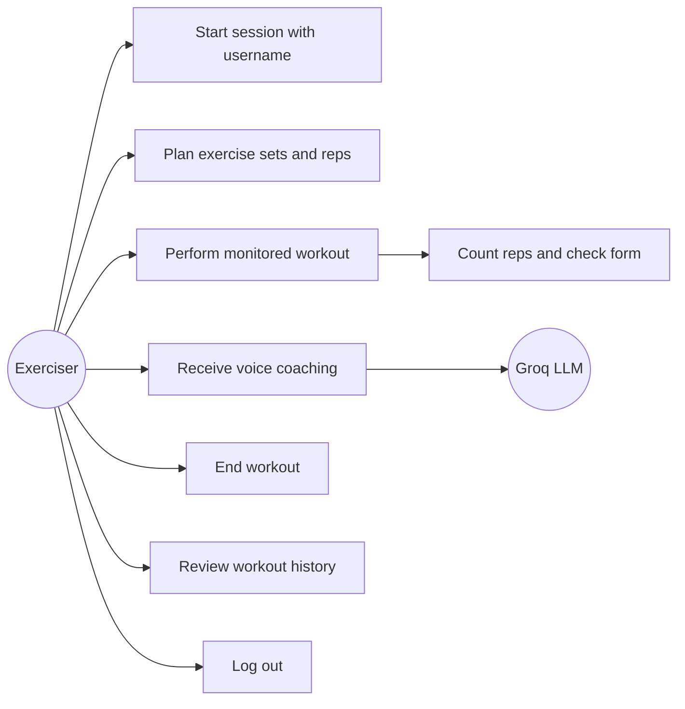

### UML 2 — Class Diagram

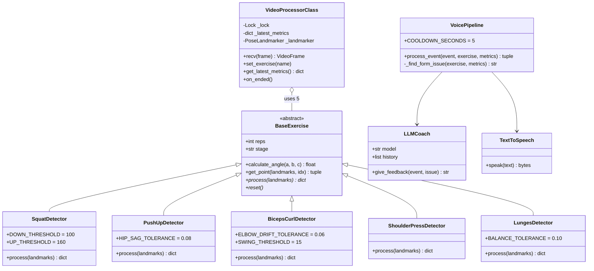

### UML 3 — Sequence Diagram (form correction during a set)

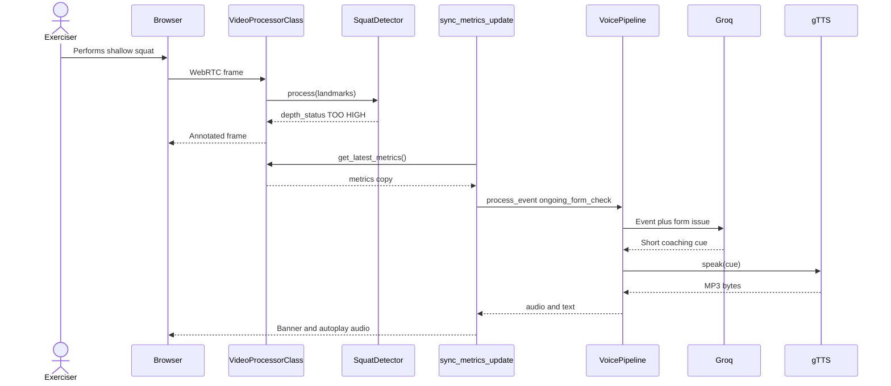

### UML 4 — Collaboration Diagram

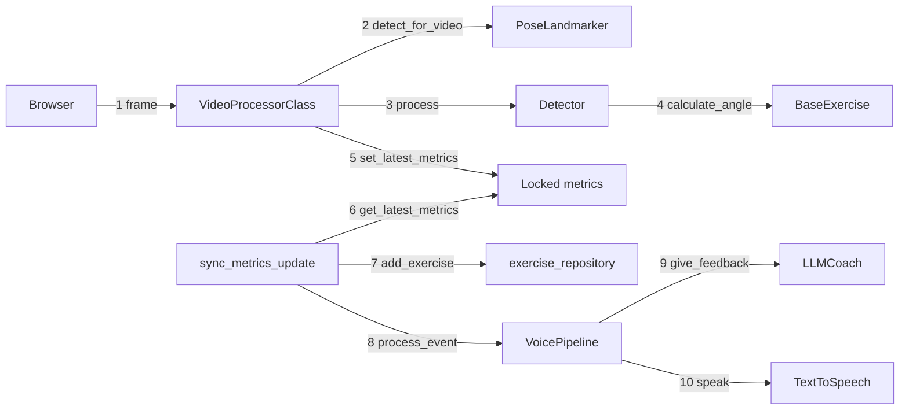

### UML 5 — Activity Diagram (one workout)

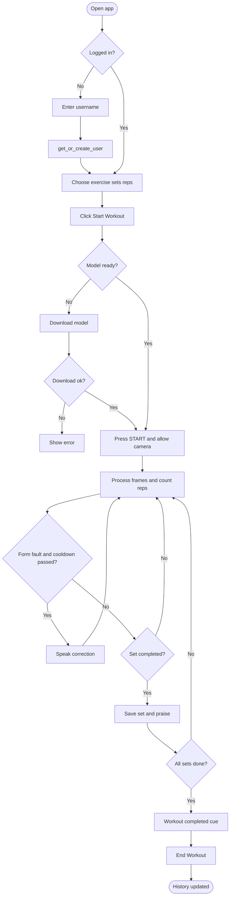

### UML 6 — State Diagram (detector rep cycle)

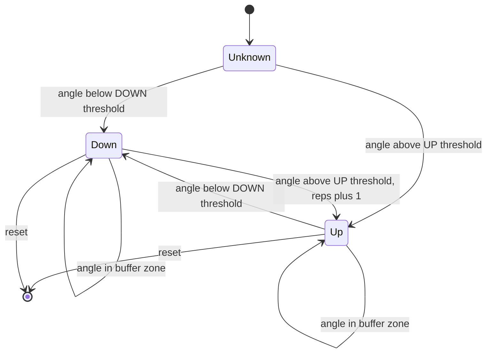

*(Biceps Curl and Shoulder Press use the same machine with "up"/"down" meaning curled/extended and pressed/start respectively.)*

### UML 7 — Component Diagram

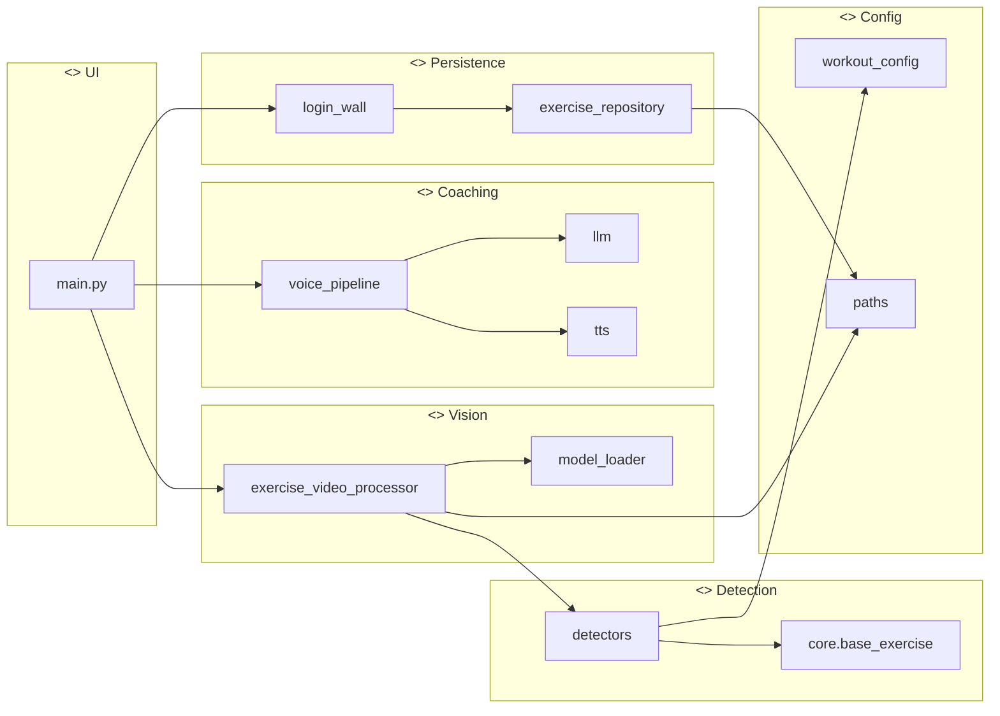

### UML 8 — Deployment Diagram

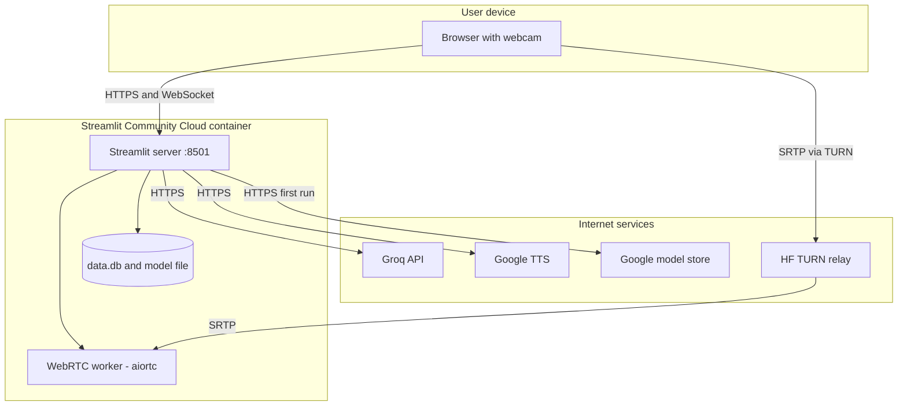

### UML 9 — Package Diagram

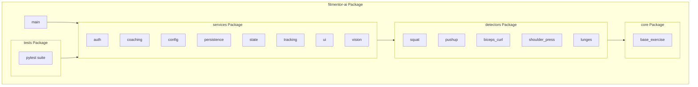

### Swimlane — one form correction across actors

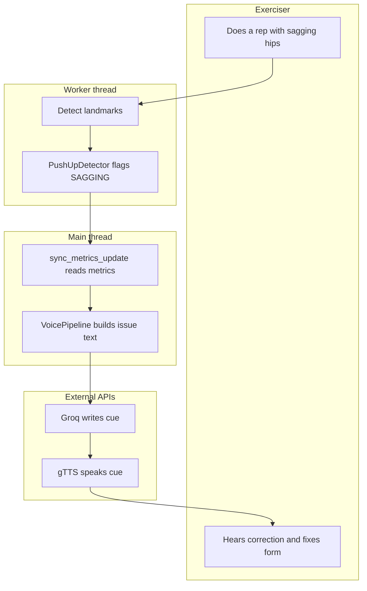

</details>

<details>
<summary><b>📊 Data Flow Diagrams (Level 0 and Level 1)</b></summary>

### DFD Level 0 — Context

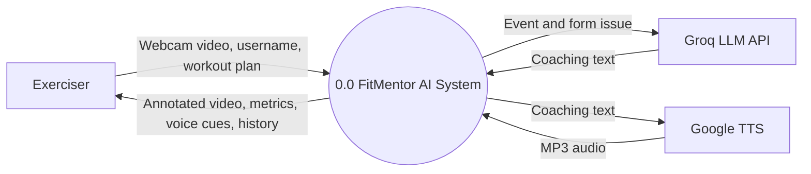

### DFD Level 1 — System

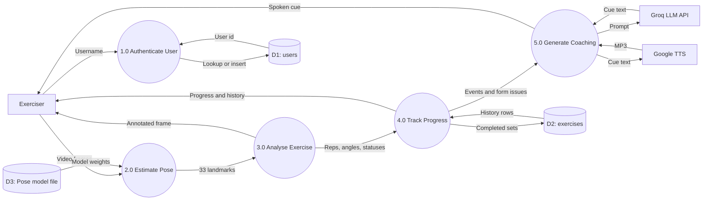

</details>

---

## 📈 Results

| Check | Environment | Result |
|---|---|---|
| Full test suite (65 tests) | Linux, Python 3.10, MediaPipe 1.0.1 | **65 passed** |
| Full test suite | Windows 11, Python 3.13, MediaPipe 1.0.1 | **64 passed, 1 skipped** (real-photo test needs optional `scikit-image`) |
| Real-model inference, all 5 exercise modes | Linux, laptop-class CPU | pose detected in every mode |
| Pose pipeline latency | same CPU, 20 frames | **≈16.5 ms per frame (≈60 FPS)** |
| End-to-end UI | local server, browser | login → plan → start → end → logout, no errors |

<p align="center"></p>

> ⚠️ Accuracy was verified with synthetic poses (exact joint angles) and manual trials — there is no labelled multi-person dataset, so no precision/recall figures are claimed.

---

## 🎯 How the Detection Works

### Turning three points into an angle — `core/base_exercise.py`

```python
def calculate_angle(self, a, b, c):          # b is the joint (e.g. the knee)
    ax, ay = a[0] - b[0], a[1] - b[1]         # vector b → a
    cx, cy = c[0] - b[0], c[1] - b[1]         # vector b → c
    dot = ax * cx + ay * cy
    mag_a, mag_c = math.hypot(ax, ay), math.hypot(cx, cy)
    if mag_a * mag_c == 0:
        return 0.0
    cos_angle = max(-1.0, min(1.0, dot / (mag_a * mag_c)))   # clamp: float drift would crash acos
    return math.degrees(math.acos(cos_angle))
```

`cos θ = (A·B) / (|A||B|)`. Straight leg ≈ 180°, deep squat ≤ 100°.

### Counting reps with hysteresis

A single threshold double-counts because landmarks jitter. Two thresholds leave a "dead zone" in between where nothing changes, and a rep only counts on the **down → up** transition:

| Exercise | Primary angle | Down / Up | Form checks |
|---|---|---|---|
| Squats | hip–knee–ankle | < 100° / ≥ 160° | depth status; back angle < 130° = leaning forward |
| Push-ups | shoulder–elbow–wrist | < 90° / > 160° | body line (shoulder–hip–ankle); hip ±0.08 from midline = sag/pike |
| Biceps Curl | shoulder–elbow–wrist | < 50° curled / > 160° extended | elbow drift > 0.06; torso tilt > 15° = swing |
| Shoulder Press | shoulder–elbow–wrist | ≥ 160° up / < 90° down | 4-band extension; back arch (shoulder–hip–knee) |
| Lunges | front knee (more bent leg) | < 100° / > 160° | torso angle; shoulder–hip lateral offset > 0.10 = off balance |

Every detector also picks the **more visible side** of the body and ignores landmarks with visibility < 0.7.

---

## 📁 Folder Structure

<details>
<summary>Annotated tree</summary>

```
fitmentor-ai/
├── main.py                       # Streamlit entry point: UI, workout loop, camera widget
├── requirements.txt              # Runtime dependencies (pinned)
├── requirements-dev.txt          # + pytest, scikit-image
├── packages.txt                  # apt packages for Streamlit Community Cloud
├── Dockerfile / .dockerignore    # Optional container (Docker hosts / HF Spaces)
├── deploy_hf.sh                  # Clean snapshot push to a Hugging Face Space
├── download_model.py             # Optional manual model download
├── .env.example                  # GROQ_API_KEY, HF_TOKEN template
├── .gitattributes                # Line-ending rules (keeps .sh and Dockerfile LF)
├── core/
│   └── base_exercise.py          # Abstract detector + calculate_angle()
├── detectors/                    # One rule-based detector per exercise
│   ├── squat.py  pushup.py  biceps_curl.py  shoulder_press.py  lunges.py
├── services/
│   ├── paths.py                  # Absolute paths (project root, model, db, static)
│   ├── auth/login_wall.py        # Username-only session gate
│   ├── coaching/                 # llm.py, tts.py, voice_pipeline.py
│   ├── config/workout_config.py  # Exercise list, skeleton edges, metric fields, LLM prompt
│   ├── persistence/exercise_repository.py  # SQLite users + exercises
│   ├── state/session_defaults.py # Seeds st.session_state
│   ├── tracking/metrics.py       # Worker-thread metrics → session state, sets, events
│   ├── ui/style_loader.py        # CSS / font / video styling
│   └── vision/                   # exercise_video_processor.py, model_loader.py
├── static/style.css              # Visual polish
├── tests/                        # 65 pytest tests
├── docs/images/                  # README images
└── ml_models/                    # pose_landmarker_full.task (downloaded, gitignored)
```

</details>

---

## ✅ Prerequisites

- Python **3.10 – 3.13** (MediaPipe 1.0.1 wheels)
- A webcam and a Chromium/Firefox browser
- Optional: free **Groq API key** (voice coaching) — [console.groq.com](https://console.groq.com)
- Optional locally / recommended in the cloud: **Hugging Face read token** (TURN relay) — [huggingface.co/settings/tokens](https://huggingface.co/settings/tokens)

## 🚀 Installation

```bash
git clone https://github.com/KARTHIKAKRISHNA123/fitmentor-ai.git
cd fitmentor-ai
uv venv && source .venv/Scripts/activate      # macOS/Linux: source .venv/bin/activate
uv pip install -r requirements.txt
cp .env.example .env                          # paste your keys
streamlit run main.py
```

Open http://localhost:8501, enter a name, choose an exercise, click **Start Workout**, then **START** and allow camera access. The pose model (~9 MB) downloads automatically the first time.

## 🔐 Environment Variables

| Variable | Required | Used by | Purpose |
|---|---|---|---|
| `GROQ_API_KEY` | No (voice off without it) | `main.py → LLMCoach` | Groq authentication |
| `HF_TOKEN` | No locally, **yes in the cloud** | streamlit-webrtc | Fetches Hugging Face TURN credentials so the webcam connects through NAT/proxies |
| `GROQ_MODEL` | No | `LLMCoach` | Override `llama-3.3-70b-versatile` |
| `TWILIO_ACCOUNT_SID` / `TWILIO_AUTH_TOKEN` | No | streamlit-webrtc | Alternative TURN provider (takes precedence over HF) |

Lookup order in `main.py :: _get_secret()`: environment variable (`.env` locally, platform secrets in the cloud) → `st.secrets`.

## ⚙️ Configuration Guide

- **Exercises, metric fields, skeleton edges, LLM prompt** → `services/config/workout_config.py`
- **Thresholds** → class constants at the top of each `detectors/*.py`
- **Coaching cooldown** → `VoicePipeline.COOLDOWN_SECONDS` (5 s)
- **Model confidence** → `min_*_confidence=0.7` in `VideoProcessorClass.__init__`
- **Paths** → `services/paths.py`

## 🔌 API Documentation

FitMentor AI exposes **no REST API** — it is a single Streamlit application. Its external calls:

| Direction | Endpoint | Method | Payload | Used in |
|---|---|---|---|---|
| Outbound | Groq `chat.completions` | HTTPS POST (SDK) | system prompt, ≤ 10 history turns, `Event: … Form Issue: …` | `services/coaching/llm.py` |
| Outbound | Google Translate TTS | HTTPS (gTTS) | cue text | `services/coaching/tts.py` |
| Outbound | `storage.googleapis.com/mediapipe-models/…/pose_landmarker_full.task` | HTTPS GET | — | `services/vision/model_loader.py` |
| Outbound | `fastrtc-turn-server-login.hf.space/credentials` | HTTPS GET | `X-HF-Access-Token` | streamlit-webrtc (when `HF_TOKEN` set) |
| Internal | Streamlit `/_stcore/health` | GET | — | Docker `HEALTHCHECK` |

## 🗄️ Database Schema

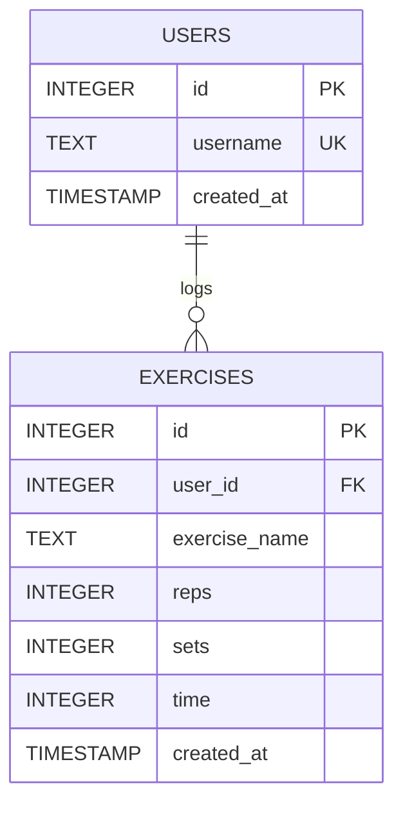

`add_exercise()` keeps **one row per user, per exercise, per day**: a second set of squats on the same day updates the existing row instead of inserting another. One shared connection is cached with `@st.cache_resource`; all queries are parameterised.

## 🔑 Authentication Flow

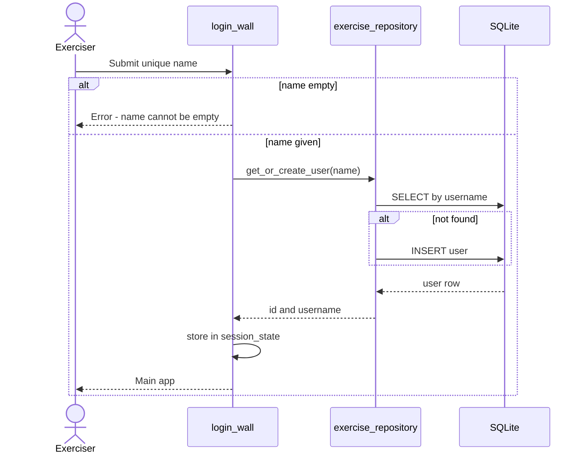

Username-only by design (academic prototype). See [Security](#-security-considerations).

## 🖥️ Backend Architecture

There is no separate frontend codebase: Streamlit renders the UI from Python, and the "backend" is the same process. Two execution contexts matter:

| Context | Runs | Allowed to |
|---|---|---|
| Script thread (reruns) | `main.py`, sidebar, `sync_metrics_update`, coaching, DB | use `st.*` |
| WebRTC worker thread | `VideoProcessorClass.recv`, MediaPipe, detectors | **not** use `st.*`; shares data only through the lock |

## 🔒 Security Considerations

| Threat | Mitigation | Status |
|---|---|---|
| API keys leaked to GitHub | `.env` + `.streamlit/secrets.toml` gitignored; keys only from env/secrets | ✅ |
| SQL injection | Parameterised queries everywhere | ✅ |
| Video privacy | Frames processed in memory only; never stored or sent to third parties (only text cues go to Groq) | ✅ |
| Account impersonation | Anyone typing an existing username sees that history | ⚠️ accepted for prototype — add passwords/OAuth before real use |
| Corrupt model file | Atomic download + minimum-size check | ✅ |
| XSRF when iframed | Disabled only in the Docker image (needed by HF iframe hosting) | ⚠️ documented |

## ⚡ Performance Optimizations

- MediaPipe in **VIDEO** mode reuses tracking between frames instead of re-detecting every frame.
- `async_processing=True` keeps video smooth even if processing briefly lags.
- The 0.25 s UI rerun loop decouples UI refresh from the 30 FPS video loop.
- Coaching is throttled (5 s cooldown) and short (`max_tokens=60`).
- One cached SQLite connection; one landmarker per stream, closed in `on_ended()`.
- Docker image bakes the model in so the first visitor doesn't wait.

## 📐 Scalability Design

Built for single-user / demo scale. Limits and the path beyond them:

| Constraint | Today | To scale |
|---|---|---|
| CPU per stream | ~16 ms/frame per viewer | more CPUs, or browser-side MediaPipe (WASM) |
| SQLite on ephemeral disk | resets on cloud restart | Postgres / Supabase |
| Media through server | every frame travels to the server | client-side inference, send only metrics |

---

## ☁️ Deployment Guide

### Local

See [Installation](#-installation).

### Streamlit Community Cloud (recommended, free)

1. Push to GitHub.
2. [share.streamlit.io](https://share.streamlit.io) → **Create app** → repo `KARTHIKAKRISHNA123/fitmentor-ai`, branch `main`, file `main.py`.
3. **Advanced settings** → Python **3.11** → Secrets:
   ```toml
   GROQ_API_KEY = "your_groq_key"
   HF_TOKEN = "your_hf_read_token"
   ```
4. **Deploy.** Streamlit installs `requirements.txt` + `packages.txt` (it ignores the Dockerfile). First build ≈ 5–10 min.

If the build log says `Unable to locate package libglib2.0-0t64`, change that line in `packages.txt` to `libglib2.0-0` and push.

### 🐳 Docker (optional)

```bash
docker build -t fitmentor-ai .
docker run -p 8501:8501 -e GROQ_API_KEY=... -e HF_TOKEN=... fitmentor-ai
```

`python:3.11-slim-bookworm` → OpenCV + MediaPipe system libs → non-root user (UID 1000) → `pip install` → pose model baked in → `streamlit run main.py --server.port=8501 --server.enableXsrfProtection=false`.

**Hugging Face Spaces note:** HF retired its Streamlit SDK (April 2025); Streamlit apps now need a Docker Space, which requires paid CPU hardware on free accounts — ZeroGPU is Gradio-only. If you have access, create a Docker Space on CPU hardware, add the two secrets, `git remote add space https://huggingface.co/spaces/<user>/fitmentor-ai`, and run `bash deploy_hf.sh` (pushes a history-free snapshot, since HF rejects binary files in history).

### CI/CD

No CI pipeline is configured yet. Suggested GitHub Actions job: install `requirements-dev.txt` + `libegl1 libgles2`, run `pytest -q` on every push.

---

## 🧪 Testing Strategy

```bash
uv pip install -r requirements-dev.txt
pytest -q
```

| File | What it proves |
|---|---|
| `test_geometry.py` | angle maths incl. zero-length vectors and float-drift clamping |
| `test_detectors.py` | rep cycles, half reps ignored, jitter counted once, low-visibility frames ignored, every form status, UI field contract |
| `test_coaching.py` | major events always speak, cooldown, LLM/TTS failures never crash, issue mapping for all exercises, prompt + history trimming |
| `test_persistence.py` | idempotent schema, user dedupe, same-day aggregation, per-user isolation |
| `test_metrics.py` | sets derived from reps, completion fires once, no double-saves, no-pose cue |
| `test_app_ui.py` | login, empty-name error, planner, start/end workout, logout (Streamlit `AppTest`) |
| `test_vision_pipeline.py` | real model on empty frames, timestamp ordering, real person detected in all 5 modes |

Synthetic poses are built with `tests/conftest.py :: place_joint()`, which positions three landmarks to produce an **exact** joint angle — so detectors are tested without a camera.

## 🧯 Error Handling Strategy

| Failure | Behaviour |
|---|---|
| No pose in frame | On-video warning + spoken reposition cue |
| Low landmark visibility | Frame ignored for counting |
| Model download fails | `st.error` with guidance; app keeps running |
| Groq error / bad key / rate limit | Warning logged, cooldown applied, workout continues |
| gTTS error | Text cue still shown |
| No `GROQ_API_KEY` | Voice coaching silently disabled |
| No `secrets.toml` | Handled in `_get_secret()` |

## 📝 Logging Strategy

Standard `logging` module, module-level loggers (`services.coaching.voice_pipeline`, `services.vision.model_loader`). Coaching and download failures log at `WARNING`. streamlit-webrtc/aiortc logs can be quietened with `logging.getLogger("aioice").setLevel(logging.WARNING)`.

## ⚖️ Engineering Decisions and Tradeoffs

| Decision | Why | Tradeoff |
|---|---|---|
| Rule-based detectors, no trained classifier | No dataset needed, fully explainable, easy to extend | Fixed thresholds don't adapt to body proportions |
| Two thresholds (hysteresis) | Prevents double counting from jitter | Very shallow reps never count (by design) |
| Server-side inference via WebRTC | Reuses Python MediaPipe + OpenCV | Needs TURN in the cloud; CPU cost per viewer |
| LLM for wording, rules for judging | Natural, varied cues without letting the LLM decide correctness | Network dependency for voice |
| SQLite | Zero setup | Not persistent on free cloud hosting |
| Username-only login | Frictionless demo | Not secure for real users |
| `mediapipe==1.0.1` | Wheels for Python 3.10–3.13 | Needs `libegl1`/`libgles2` on Linux |

## 🗺️ Future Roadmap

- [ ] Per-user calibration of thresholds
- [ ] Labelled multi-person dataset → precision/recall per exercise
- [ ] Side-view prompts for push-ups
- [ ] Password/OAuth login + hosted Postgres
- [ ] More exercises (planks with hold timer, deadlifts)
- [ ] Offline fallback audio cues
- [ ] Browser-side inference (MediaPipe WASM) to remove server video load
- [ ] GitHub Actions CI

## 🛠️ Troubleshooting

| Symptom | Fix |
|---|---|
| `No solution found … mediapipe==0.10.14 … cp313` | Use `requirements.txt` as is (`mediapipe==1.0.1`) |
| `OSError: libEGL.so.1` on Linux | `apt install libegl1 libgles2` (already in `packages.txt` / Dockerfile) |
| Camera stuck on "Connecting…" in the cloud | Add `HF_TOKEN` secret (TURN relay) |
| No camera prompt | Must be HTTPS or `localhost`; check browser camera permissions |
| No voice | Set `GROQ_API_KEY`; check browser autoplay settings |
| `fatal: Unable to create '.git/index.lock'` | `rm -f .git/index.lock` |
| `LF will be replaced by CRLF` | Harmless on Windows |

## ❓ FAQ

**Does it record my video?** No. Frames are processed in memory and discarded; only short text cues go to Groq.
**Does it need a GPU?** No — ≈60 FPS on a laptop CPU in tests.
**Can I add an exercise?** Subclass `BaseExercise`, register it in `VideoProcessorClass._detectors`, add its fields to `METRICS_FIELDS` and `EXERCISE_OPTIONS`, and add its sidebar metrics in `main.py`.

---

## 🧭 Rebuilding It Yourself — a Suggested Order

1. **`core/base_exercise.py`** — write `calculate_angle()`; test that a right angle gives 90°.
2. **`detectors/squat.py`** — count reps against fake landmarks (snippet below), no camera yet.
3. **`services/vision/exercise_video_processor.py`** — MediaPipe + OpenCV skeleton on your webcam, no detector.
4. **Connect 2 and 3** — watch the counter rise live.
5. **Other four detectors** — same shape, different landmarks and thresholds.
6. **`services/persistence`** — SQLite, save after each set.
7. **`services/coaching`** — LLM + TTS last, once the numbers are right.

```python
class FakeLandmark:
    def __init__(self, x, y, visibility=1.0):
        self.x, self.y, self.visibility = x, y, visibility

landmarks = [FakeLandmark(0, 0) for _ in range(33)]
landmarks[23] = FakeLandmark(0.5, 0.5)   # hip
landmarks[25] = FakeLandmark(0.5, 0.75)  # knee
landmarks[27] = FakeLandmark(0.5, 1.0)   # ankle → straight leg, ~180°

from detectors.squat import SquatDetector
print(SquatDetector().process(landmarks))
```

---

## 🤝 Contributing

1. Fork and create a branch: `git checkout -b feat/my-change`
2. Add tests for new behaviour; run `pytest -q`
3. Commit with a conventional message (`feat:`, `fix:`, `test:`) and open a PR

## 📄 License

No license file has been added yet — all rights reserved by the author until one is chosen (MIT is a common choice for portfolio projects).

## 🙏 Credits and Acknowledgements

- Architecture adapted from the open-source reference [`ai-gym-coach`](https://github.com/shradha-khapra/ai-gym-coach) by Shradha Khapra, rebuilt and extended as FitMentor AI.
- [Google MediaPipe](https://ai.google.dev/edge/mediapipe) BlazePose · [streamlit-webrtc](https://github.com/whitphx/streamlit-webrtc) by whitphx · [Groq](https://groq.com) + Meta Llama 3.3 · [gTTS](https://github.com/pndurang/gTTS)
- Test photo: NASA astronaut Eileen Collins (public domain), via scikit-image.

<div align="center">

Built by **Karthika Krishna M** · B.E. Computer Science and Engineering, Anna University Regional Campus, Tirunelveli

</div>
